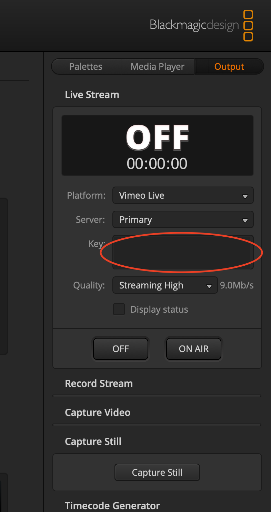

# Atem Mini

Install latest [ATEM Switcher Software](https://www.blackmagicdesign.com/support/family/atem-live-production-switchers) to interface with ATEM Mini Pro and ATEM Mini Extreme

## Streaming.xml File

Latest Streaming.xml file (04/24/2022) is located in this directory with the Vimeo and Streaming Bridge changes included.  To install, backup your computer's Streaming.xml file first:
```bash
sudo mv /Library/Application\ Support/Blackmagic\ Design/Switchers/Streaming.xml /Library/Application\ Support/Blackmagic\ Design/Switchers/Streaming-backup.xml
```
Then, copy the Streaming.xml file from this repository to the correct directory:
```bash
git clone https://github.com/kevinwongtyl/stream-docs.git ~/Documents/stream-docs
sudo cp ~/Documents/stream-docs/atem-mini-switchers/Streaming.xml /Library/Application\ Support/Blackmagic\ Design/Switchers/Streaming.xml
```

## Adding Streaming Bridge to ATEM Switcher Software
Adds a local RTMP connection to a Streaming Bridge.  We use this to add a program SDI and HDMI output to the ATEM Mini Extreme with an explicitly controlled bitrate.  This also ends up being the recording quality, since the ATEM Mini Extreme uses the same quality settings for recording as it does streaming.

```bash
sudo vim /Library/Application\ Support/Blackmagic\ Design/Switchers/Streaming.xml
```

before the end `</streaming>` add:

```xml
<service>
        <name>Streaming Bridge</name>
        <servers>
                <server>
                        <name>Local Ethernet</name>
                        <url>rtmp://StreamingBridge-9433F61CCC6E46ADAB8175367E9AD427.local:1935/app</url>
                </server>
        </servers>
        <profiles>
                <profile>
                        <name>Streaming High</name>
                        <config resolution="1080p" fps="60">
                                <bitrate>10000000</bitrate>
                                <audio-bitrate>320000</audio-bitrate>
                                <keyframe-interval>2</keyframe-interval>
                        </config>
                        <config resolution="1080p" fps="30">
                                <bitrate>7000000</bitrate>
                                <audio-bitrate>320000</audio-bitrate>
                                <keyframe-interval>2</keyframe-interval>
                        </config>
                </profile>
                <profile>
                        <name>Streaming Medium</name>
                        <config resolution="1080p" fps="60">
                                <bitrate>7000000</bitrate>
                                <audio-bitrate>128000</audio-bitrate>
                                <keyframe-interval>2</keyframe-interval>
                        </config>
                        <config resolution="1080p" fps="30">
                                <bitrate>4500000</bitrate>
                                <audio-bitrate>128000</audio-bitrate>
                                <keyframe-interval>2</keyframe-interval>
                        </config>
                </profile>
                <profile>
                        <name>Streaming Low</name>
                        <config resolution="1080p" fps="60">
                                <bitrate>4500000</bitrate>
                                <audio-bitrate>128000</audio-bitrate>
                                <keyframe-interval>2</keyframe-interval>
                        </config>
                        <config resolution="1080p" fps="30">
                                <bitrate>3000000</bitrate>
                                <audio-bitrate>128000</audio-bitrate>
                                <keyframe-interval>2</keyframe-interval>
                        </config>
                </profile>
        </profiles>
</service>
`

## Adding Vimeo Live to ATEM Switcher Software

Install latest [ATEM Switcher Software](https://www.blackmagicdesign.com/support/family/atem-live-production-switchers) to interface with ATEM Mini Pro.

```bash
sudo vim /Library/Application\ Support/Blackmagic\ Design/Switchers/Streaming.xml
```

before the end `</streaming>` add:
```xml
<service>
        <name>Vimeo Live</name>
        <servers>
                <server>
                        <name>Primary</name>
                        <url>rtmp://rtmp-global.cloud.vimeo.com/live</url>
                </server>
        </servers>
        <profiles>
                <profile>
                        <name>Streaming High</name>
                        <config resolution="1080p" fps="60">
                                <bitrate>9000000</bitrate>
                                <audio-bitrate>128000</audio-bitrate>
                                <keyframe-interval>2</keyframe-interval>
                        </config>
                        <config resolution="1080p" fps="30">
                                <bitrate>6000000</bitrate>
                                <audio-bitrate>128000</audio-bitrate>
                                <keyframe-interval>2</keyframe-interval>
                        </config>
                </profile>
                <profile>
                        <name>Streaming Medium</name>
                        <config resolution="1080p" fps="60">
                                <bitrate>7000000</bitrate>
                                <audio-bitrate>128000</audio-bitrate>
                                <keyframe-interval>2</keyframe-interval>
                        </config>
                        <config resolution="1080p" fps="30">
                                <bitrate>4500000</bitrate>
                                <audio-bitrate>128000</audio-bitrate>
                                <keyframe-interval>2</keyframe-interval>
                        </config>
                </profile>
                <profile>
                        <name>Streaming Low</name>
                        <config resolution="1080p" fps="60">
                                <bitrate>4500000</bitrate>
                                <audio-bitrate>128000</audio-bitrate>
                                <keyframe-interval>2</keyframe-interval>
                        </config>
                        <config resolution="1080p" fps="30">
                                <bitrate>3000000</bitrate>
                                <audio-bitrate>128000</audio-bitrate>
                                <keyframe-interval>2</keyframe-interval>
                        </config>
                </profile>
        </profiles>
</service>
```

After setting this up, make sure to setup the pick the correct RTMP server and input the stream key in the output section & test it by streaming live:



``
