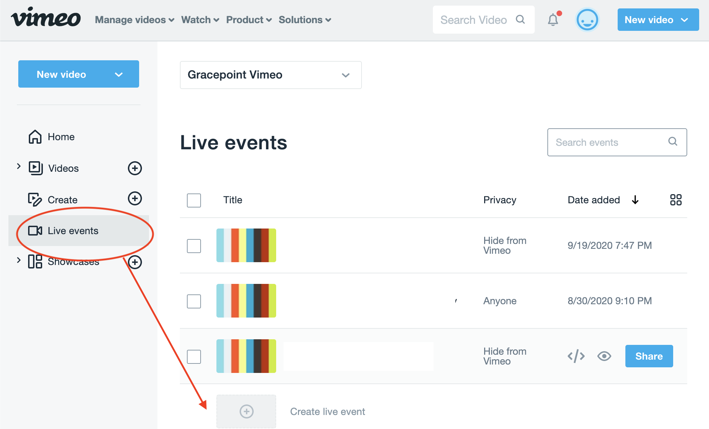
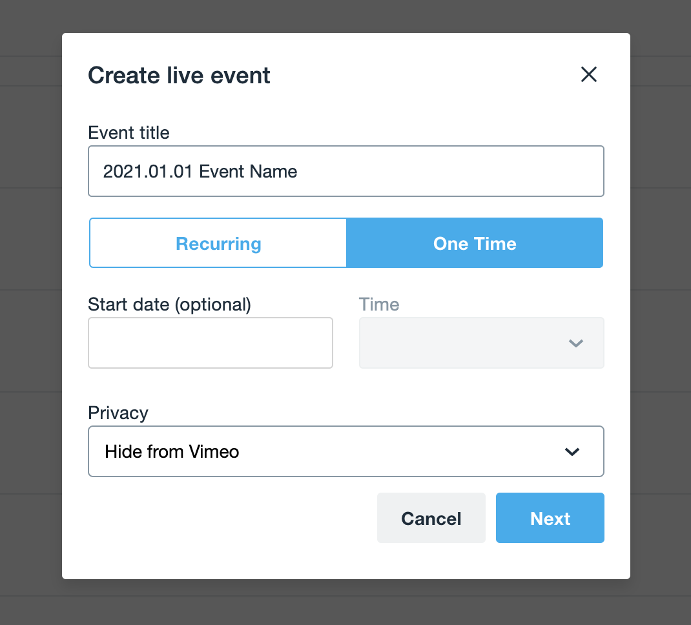
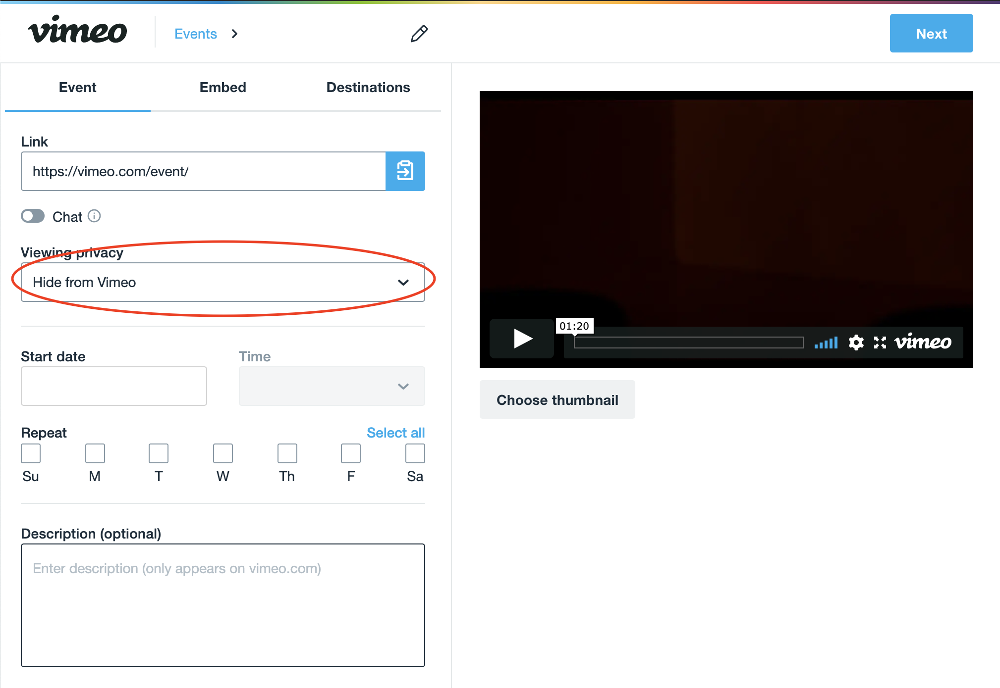
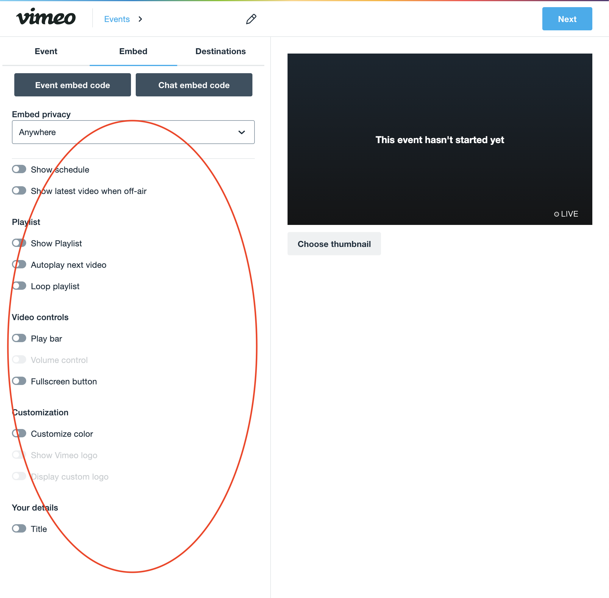
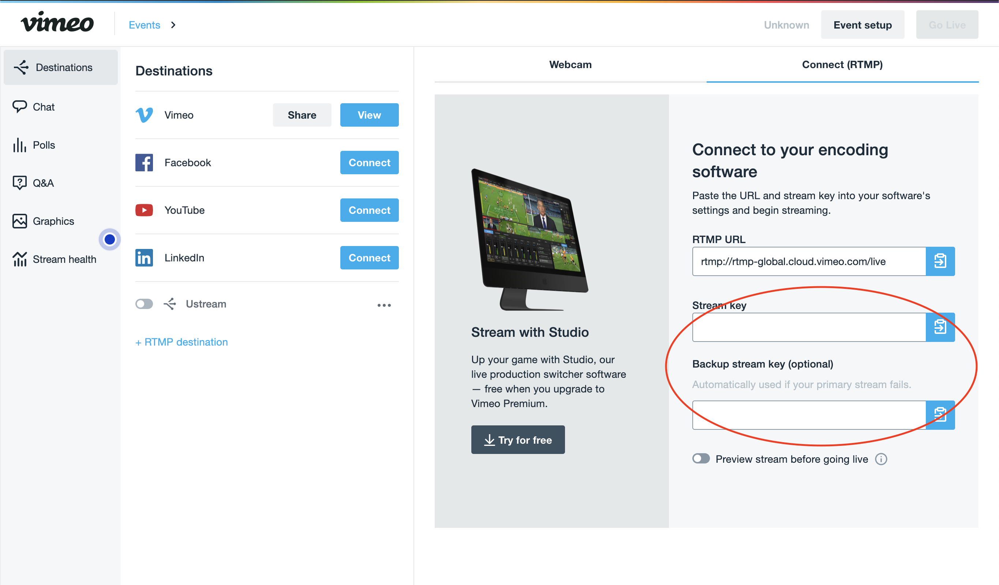
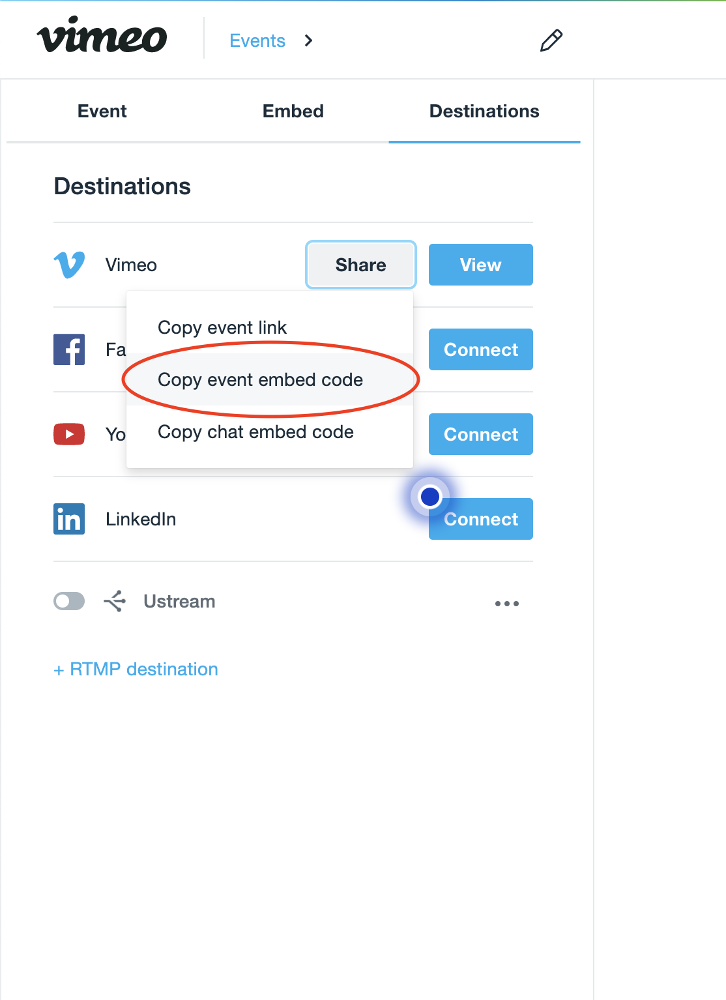

# Vimeo Live
Vimeo has a new streaming platform & ability to stream live events. This is a TL;DR version, but see the [full official documentation](https://vimeo.zendesk.com/hc/en-us/articles/115012811168-Vimeo-Live-overview) for more information.

## Create New Live Event
To create a new live event:

## Non-Public Event
If you don't want the events to public makes sure to set it off

## Modify Embedded Player Controls
Vimeo gives you the ability to hide controls from the users, make sure it's configured to what you expect.

Alternatively you have controls in the specific stream

## RTMP and Stream Key
The device streaming (OBS, Teradeck, ATEM Mini Pro, etc) will need the RTMP protocol as well as the stream-key to stream to the platform.

## Generate Embed Code
This will be used wherever you embed the video, this can be an website, or some other embeddable platform.

